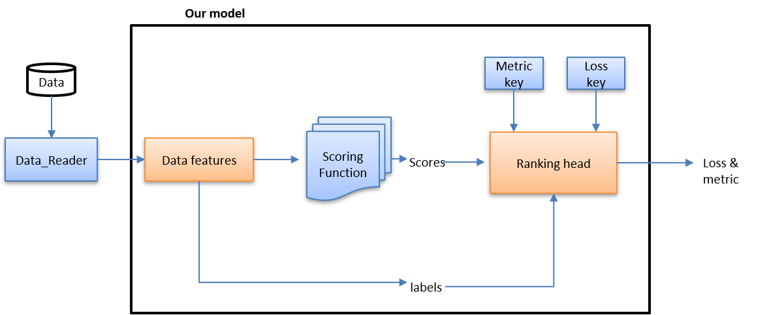
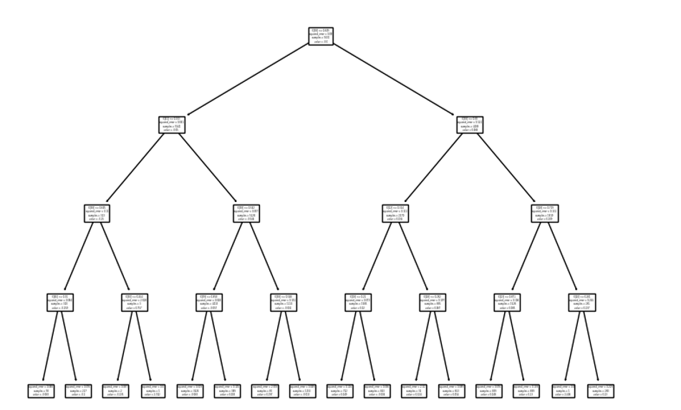

## Learning_to_rank 一个传统学习排序算法库

### 工具包说明

•当前的Learning to rank 工具包，Ranklib基于java开发，TRanking基于Tensorflow开发，XGBoost，LightGBM基于树结构的模型 

•开发一个传统Learning to rank的工具包，涉及到神经网络部分用pytorch编写

•熟悉老师上课的知识点 & 更简单，轻便的LTR模型用于实验与教学工作

•实现算法的效率可以接近这些模型的最好水平


### 算法实现

**Pointwise**：MLP

**Pairwise**：RankNet，RankSVM， LambdaRank，RankBoost

**Listwise**：LambdaMar, ListNet, ListMLE

### 实现流程


**训练阶段**：

数据处理，特征提取，评分函数构建




**测试阶段：**


支持数据集：传统排序学习数据集，三种类型的方法，支持多种指标计算


### 需求

```
安装需求
torch>=1.10.0
numpy>=1.17.2
scikit_learn>=0.23.2
pickle
tqdm>=4.48.2
```

### 安装

使用pip方式安装

```
pip install learning-to-rank
```

从github上clone

```
$ git clone https://github.com/guankaisi/learning-to-rank.git
$ cd learning-to-rank
$ pip install -r requirements.txt
$ python setup.py install
```

### 使用说明

提供了test.py测试脚本

首先调用你想要使用的模型，调用data_reader

```python
from  learning_to_rank.listwise import LambdaMART,ListNet,ListMLE
from learning_to_rank.pairwise import RankNet,LambdaRank
from learning_to_rank.poinstwise import NRegression
from learning_to_rank.utils import data_reader
```

这里我们用LETOR 4.0 中的MQ2008进行实验

用data_reader进行数据读取

```python
for i in [1,2,3,4,5]:
   print('start Fold ' + str(i))
   training_data = data_reader('MQ2008/Fold%d/train.txt' % (i))
   test_data = data_reader('MQ2008/Fold%d/test.txt' % (i)
```

定义模型，并通过model.fit()开始训练

```
model = LambdaMART(training_data, number_of_trees=100, lr=0.001,max_depth=50)
model.fit()
```

模型验证，定义ndcg@k中的k值

```python
average_ndcg, predicted_scores = model.validate(test_data, k=10)
print(average_ndcg)
```

这里面直接计算给出了ndcg，如果要计算其他指标，可以根据predicted_scores直接计算

决策树可以直接可视化，层数太深可视化会不清晰，所以该可视化决策树层数只有5层

```python
import matplotlib.pyplot as plt
from sklearn import tree
tree.plot_tree(model.trees[0])
plt.show()
```



### 达到效果

上述LambdaMart模型：

|         | **NDCG@10**        |
| ------- | ------------------ |
| Fold1   | 0.7275983469048656 |
| Fold2   | 0.6850899950641907 |
| Fold3   | 0.6654757957913352 |
| Fold4   | 0.7038660130946692 |
| Fold5   | 0.699629816361395  |
| Average | 0.6963319934432912 |

**当前lambdaMART在LETOR4.0上的SOTA为：0.822891**

我实现的LambdaMart算法和sota相比有一定的距离

可能的原因：

（1）由于设备计算资源和时间限制，num_of_trees并没有设特别大

（2）sklearn的决策树算法和XGBoost，lightGBM工具包相比有着效率和效果上的劣势
